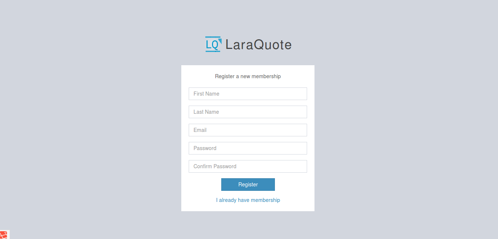
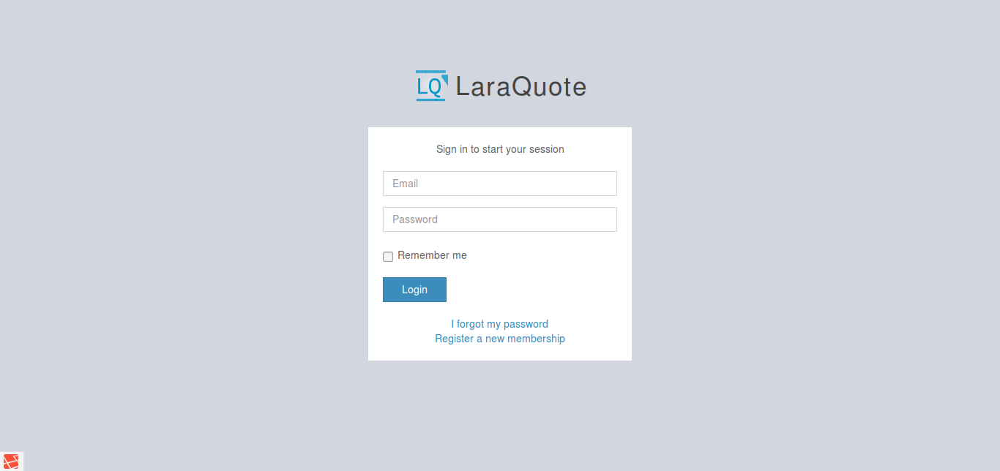
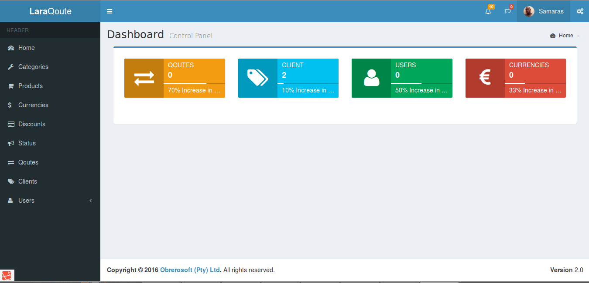
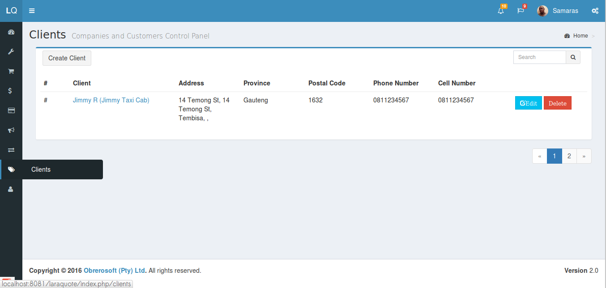
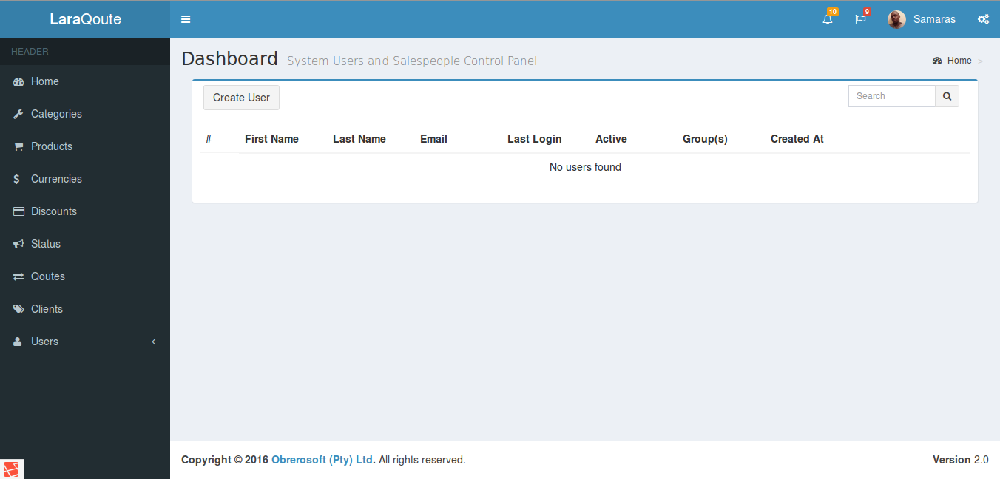
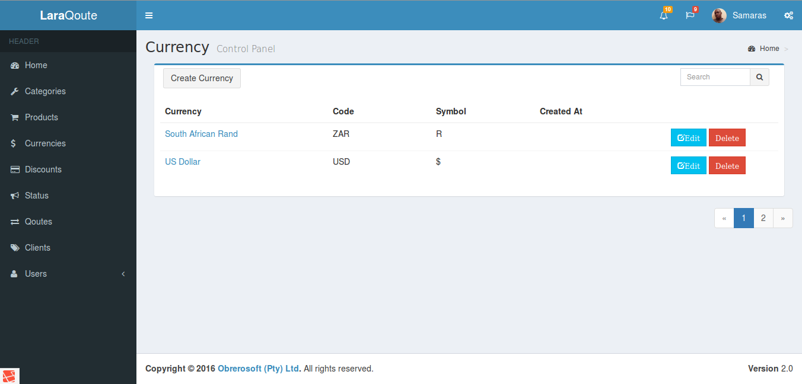
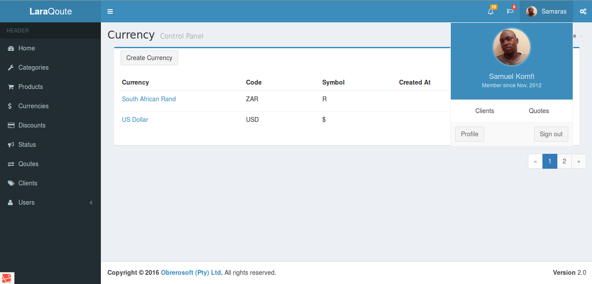
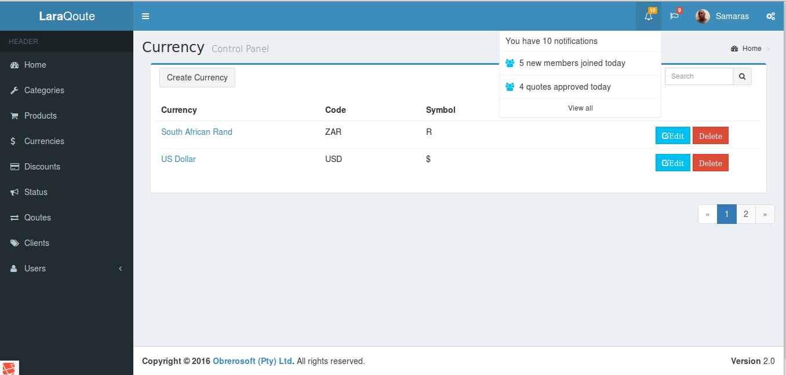

## Laraquote
Quotation application in Laravel 5.*

## Requirements

* PHP >= 5.5.6
* MySQL

## Features
* Built using Laravel 5
* Create quotes for clients
* Multiple currencies
* Product catalog

    

 

    

    

 

    

 

    

 

    

 

    

 

    

## License
See [LICENSE](LICENSE) for details.
